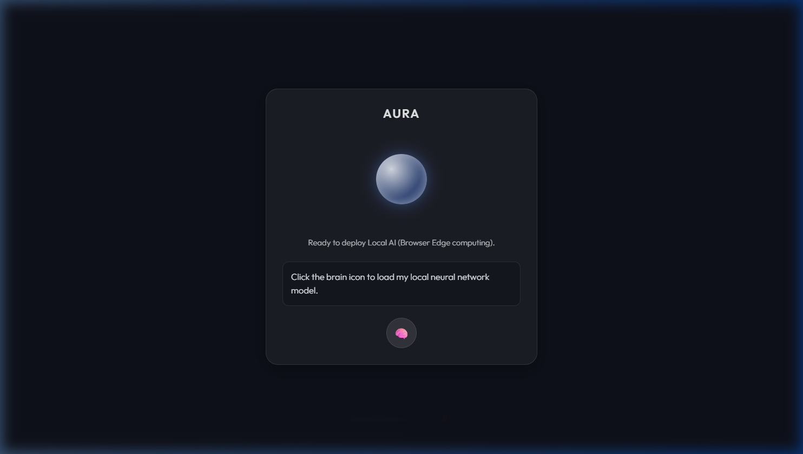

# 🔮 Aura - Premium Local AI Voice Assistant

Aura is a state-of-the-art voice assistant that runs **100% locally in your web browser**. No external API keys (OpenAI/Gemini), no cloud tracking, and no rate limits—ever. 

By leveraging **WebGPU** and **WebLLM**, Aura downloads a quantized Large Language Model (Llama 3.2 1B) directly into your browser's persistent cache and performs all artificial intelligence inference on your device's graphics card.

 

---

## ✨ Key Features

- **💎 Glassmorphic UI**: A premium, translucent interface with smooth CSS-animated visualizers that react to AI states.
- **🎙️ Web Speech API Integration**: Hands-free interaction using native browser Speech-to-Text and Text-to-Speech.
- **🧠 Edge AI Computing**: Powered by `@mlc-ai/web-llm`, running Llama 3.2 1B entirely on your local GPU.
- **⚡ Zero Latency Network**: Once the model is cached (~700MB), the AI responds instantly without sending a single byte of data to a server.
- **🌍 Privacy First**: Your voice data and AI conversations never leave your computer.

---

## 🚀 Getting Started

### Prerequisites
- A modern browser that supports **WebGPU** (Latest Chrome, Edge, or Opera).
- A device with a dedicated or integrated GPU (recommended).

### Installation
1. Clone the repository:
   ```bash
   git clone https://github.com/your-username/aura-voice-assistant.git
   cd aura-voice-assistant
   ```
2. Install dependencies:
   ```bash
   npm install
   ```
3. Run the development server:
   ```bash
   npm run dev
   ```
4. Open the local link in your browser.

---

## 🛠️ Built With

- **Vite** - Modern frontend tooling.
- **WebLLM** - High-performance in-browser LLM engine.
- **Web Speech API** - Native browser speech recognition and synthesis.
- **Vanilla CSS** - Custom glassmorphic design system.

---

## 📂 Project Structure

- `src/main.js` - Core logic for WebLLM engine, speech events, and state machine.
- `src/style.css` - Custom glassmorphism and orb visualizer animations.
- `index.html` - Minimalist application entry point.

---

## 🔒 Privacy & Data
The first time you click the 🧠 button, Aura will download approximately **700MB** of model weights into your browser's **IndexedDB** cache. This data stays on your machine and allows the AI to function offline. You can clear this storage at any time by going to your browser's Developer Tools -> Application -> Clear Storage.

---

## 📜 License
MIT License. Feel free to use and modify for your own projects!
